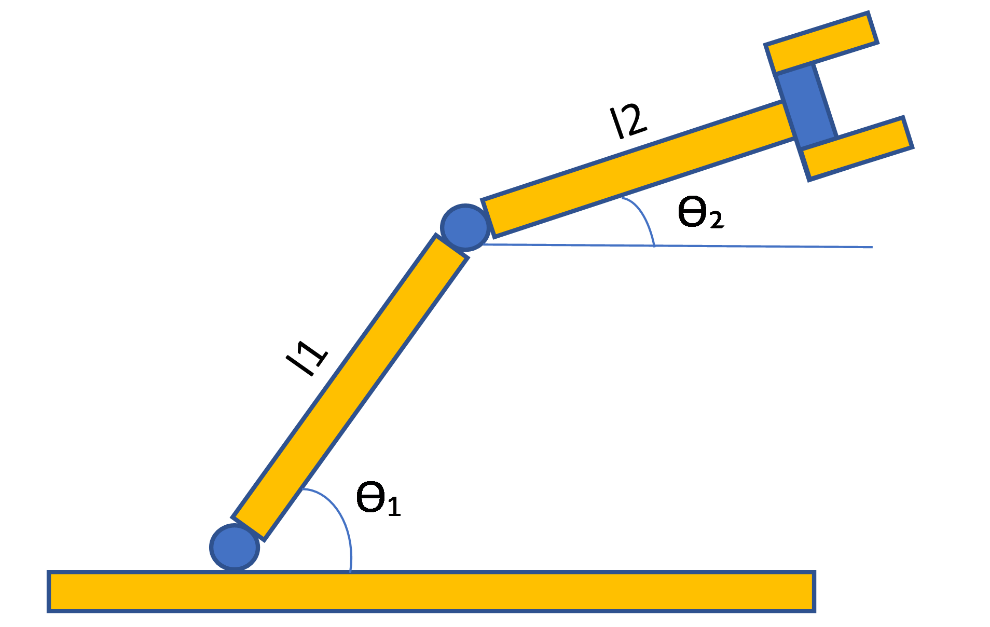

# Robot Kinematics
## 2R Robot  

## DH-Parameters
||&alpha; i-1 | a i-1 | d i | &Theta; i |
| :---: | :---: | :---: | :---: | :---: |
| 1 | 0 | 0 | 0 | q1 |
| 2 | 0 | L1 | 0 | q2 |

## Matlab Implementations
* Forward Kinematics
* Inverse Kinematics
* Velocity

 

